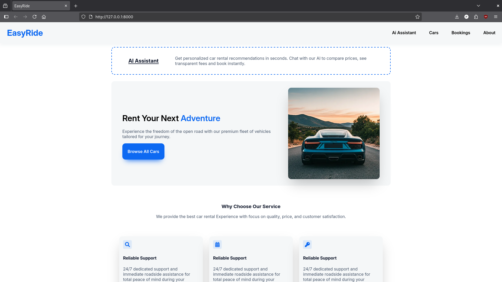
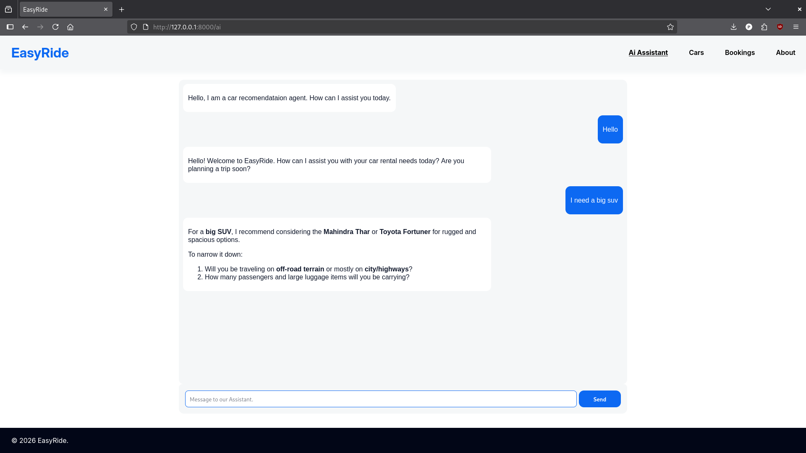
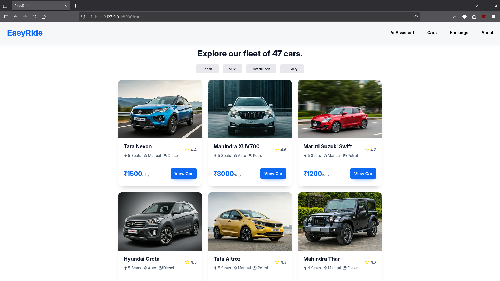
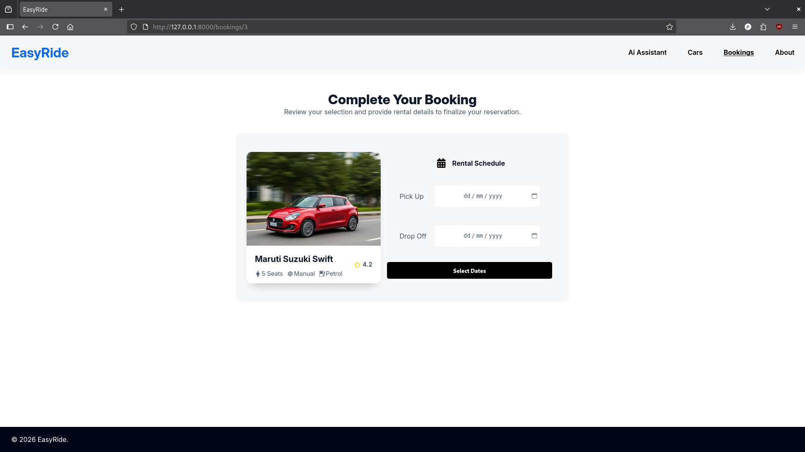

# EasyRide – Car Recommendation Platform with AI Chatbot

EasyRide is a web application that allows users to explore available cars and get recommendations through an AI-powered chatbot.

The platform is built using **React**, **React Router**, and **FastAPI**, with an AI assistant implemented using **LangChain** and a **locally hosted LLM via Ollama**.

The React frontend is built and served as **static files from the FastAPI backend**, allowing the entire application to run from a single server.

---

# Features

- Browse available cars
- View detailed car information
- AI-powered chatbot for car recommendations
- Responsive UI
- Fast backend built with FastAPI
- Real-time chat using WebSockets
- Custom 404 page

---

# Tech Stack

## Frontend
- React
- React Router
- JavaScript (ES6+)
- HTML / CSS

## Backend
- FastAPI
- Python
- WebSockets

## AI
- LangChain
- Ollama
- langchain_ollama integration

---

# Application Routes

| Route | Description |
|------|-------------|
| `/` | Landing page |
| `/ai` | AI assistant page |
| `/cars` | List all available cars |
| `/cars/:id` | View details of a specific car |
| `/bookings/:id?` | Create or manage bookings |
| `/about` | Information about the project |
| `*` | 404 Not Found page |

---

# AI Assistant

The platform includes an AI assistant that helps users explore cars and get recommendations.

The assistant can:

- Answer questions about available cars
- Suggest cars based on user preferences

The chatbot communicates with the backend using **WebSockets**, allowing real-time interaction with the language model.

---

# Local LLM Setup

The language model runs locally using **Ollama**, which allows the application to generate responses without relying on external APIs.

Advantages of running the model locally:

- Lower response latency
- No external API dependency
- Full local control of AI processing

### Model

```
ministra3:8b
```

### Integration

The model is accessed through:

```
LangChain + langchain_ollama
```

### Architecture

React → FastAPI → LangChain Agent → Ollama → ministra3:8b

---
# Hardware Used for Local LLM

The local LLM runs using Ollama on the following hardware configuration:

- **CPU:** AMD Ryzen 5 7600
- **GPU:** NVIDIA RTX 4060
- **Inference Runtime:** Ollama

This setup allows the application to handle both **web requests and AI inference locally**.

---

# Screenshots

Screenshots of the application interface can be added here.

## Landing Page
<p align="center">
  
</p>

## AI Chatbot
<p align="center">
  
</p>

## Cars Page
<p align="center">
  
</p>

## Booking
<p align="center">
  
</p>
---

# Future Improvements

Possible improvements for the project:

- Booking history tracking
- Admin dashboard

---

# Running the Application

Before starting the application, make sure **Ollama is installed** and the required model is available locally.

Install the model:

```bash
ollama pull ministra3:8b
```

Start the Ollama server if it is not already running:

```bash
ollama serve
```

The chatbot functionality will not work if the model is not available locally.

1. Clone the repository

```bash
git clone https://github.com/pdev987/EasyRide.git
cd EasyRide
```

2. Navigate to the backend folder

```bash
cd backend
```

3. Start the FastAPI server

```bash
uv run uvicorn main:app
```

4. Open the application

The server will start on:

```
http://localhost:8000
```

Open this URL in your browser to access the application.

# Author

**Prathap H R**

GitHub
https://github.com/pdev1997
